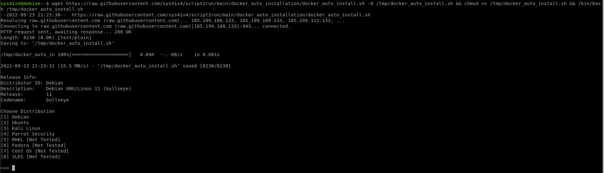

# DOCKER AUTO INSTALLATION
---
**Script Name:** docker_auto_install.sh<br>
**CREATOR:** ARIJIT BHOWMICK<br>
**TESTED ON:** GNU/Linux<br>

| Distribution | Release Version | Script Tested | Script Working | Supported Provided |
|-|-|-|-|-|
| Kali Linux Rolling | 2022.3, 2022.2  | YES | YES | YES |
| Parrot Security | 5.1 | YES | YES | YES |
| Debian | 11 | YES | YES | YES |
| Ubuntu | 22.04 | YES | YES | YES |
| RHEL | | NO | | YES |
| Fedora | | NO | | YES |
| Cent OS | | NO | | YES |
| SLES | | NO | | YES |

---

Auto download and run
```bash
wget https://raw.githubusercontent.com/sys41x4/script2run/main/docker_auto_installation/docker_auto_install.sh -O /tmp/docker_auto_install.sh && chmod +x /tmp/docker_auto_install.sh && /bin/bash /tmp/docker_auto_install.sh
```
---
### Screenshots

